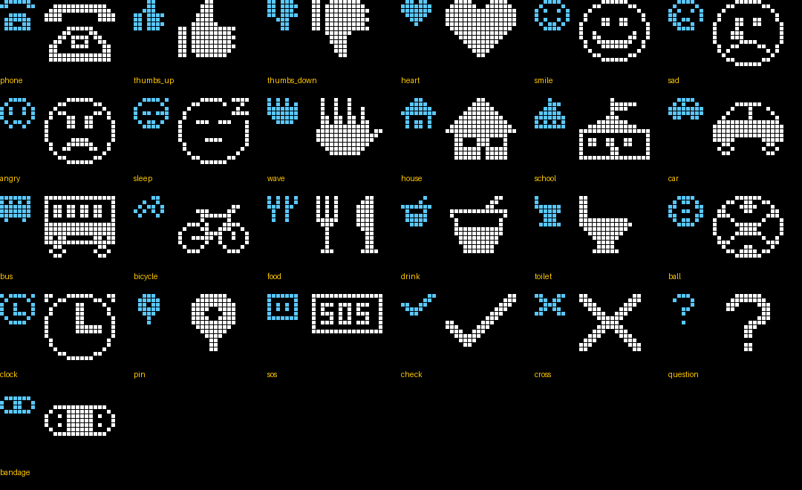

# MSPager — Emoji on the OLED

GENERATED by `bin/gen_emoji_glyphs.py` (FRD-022). These emoji show as pictures on the pager, in the
small (8×8) and the large (16×16) size. Several codepoints can share one picture (e.g. every
heart colour). Variation selectors (U+FE0F), skin tones and zero-width joiners are ignored.
**Any other emoji shows as a filled block** on the pager (the MeshCore app shows it normally).

| Picture | Meaning | Emoji (first one = preferred) |
|---|---|---|
| `phone` | Anruf / ruf mich an | 📞 `U+1F4DE` 📱 `U+1F4F1` ☎ `U+260E` |
| `thumbs_up` | Ja / gut | 👍 `U+1F44D` |
| `thumbs_down` | Nein / schlecht | 👎 `U+1F44E` |
| `heart` | Lieb dich | ❤ `U+2764` 💖 `U+1F496` 💗 `U+1F497` 💙 `U+1F499` 💚 `U+1F49A` 💛 `U+1F49B` 💜 `U+1F49C` 🧡 `U+1F9E1` 🤍 `U+1F90D` 🖤 `U+1F5A4` ♥ `U+2665` |
| `smile` | Fröhlich | 😀 `U+1F600` 😃 `U+1F603` 😄 `U+1F604` 🙂 `U+1F642` 😊 `U+1F60A` ☺ `U+263A` 😁 `U+1F601` 😆 `U+1F606` |
| `sad` | Traurig | 😢 `U+1F622` 😭 `U+1F62D` 😞 `U+1F61E` 🙁 `U+1F641` ☹ `U+2639` 😥 `U+1F625` 🥺 `U+1F97A` |
| `angry` | Wütend | 😡 `U+1F621` 😠 `U+1F620` 🤬 `U+1F92C` |
| `sleep` | Müde | 😴 `U+1F634` 💤 `U+1F4A4` 😪 `U+1F62A` |
| `wave` | Hallo / Tschüss | 👋 `U+1F44B` |
| `house` | Zuhause | 🏠 `U+1F3E0` 🏡 `U+1F3E1` |
| `school` | Schule | 🏫 `U+1F3EB` |
| `car` | Auto | 🚗 `U+1F697` 🚕 `U+1F695` 🚙 `U+1F699` |
| `bus` | Bus | 🚌 `U+1F68C` 🚍 `U+1F68D` 🚎 `U+1F68E` |
| `bicycle` | Fahrrad | 🚲 `U+1F6B2` |
| `food` | Essen | 🍴 `U+1F374` 🍽 `U+1F37D` 🍕 `U+1F355` 🍔 `U+1F354` |
| `drink` | Trinken | 🥤 `U+1F964` 💧 `U+1F4A7` 🥛 `U+1F95B` 🧃 `U+1F9C3` |
| `toilet` | Klo | 🚽 `U+1F6BD` 🚻 `U+1F6BB` |
| `ball` | Spielen / Sport | ⚽ `U+26BD` 🏀 `U+1F3C0` 🎾 `U+1F3BE` |
| `clock` | Zeit / gleich | ⏰ `U+23F0` 🕐 `U+1F550` ⌚ `U+231A` ⏲ `U+23F2` 🕒 `U+1F552` |
| `pin` | Ort | 📍 `U+1F4CD` 📌 `U+1F4CC` |
| `sos` | Hilfe! | 🆘 `U+1F198` 🚨 `U+1F6A8` |
| `check` | Erledigt / OK | ✅ `U+2705` ✔ `U+2714` ☑ `U+2611` |
| `cross` | Nein / nicht | ❌ `U+274C` ✖ `U+2716` ❎ `U+274E` |
| `question` | Frage | ❓ `U+2753` ❔ `U+2754` ⁉ `U+2049` |
| `bandage` | Verletzt / Aua | 🩹 `U+1FA79` 🤕 `U+1F915` 🤒 `U+1F912` |

To add or change a picture: edit the ASCII art in `bin/gen_emoji_glyphs.py`, run it, rebuild.
